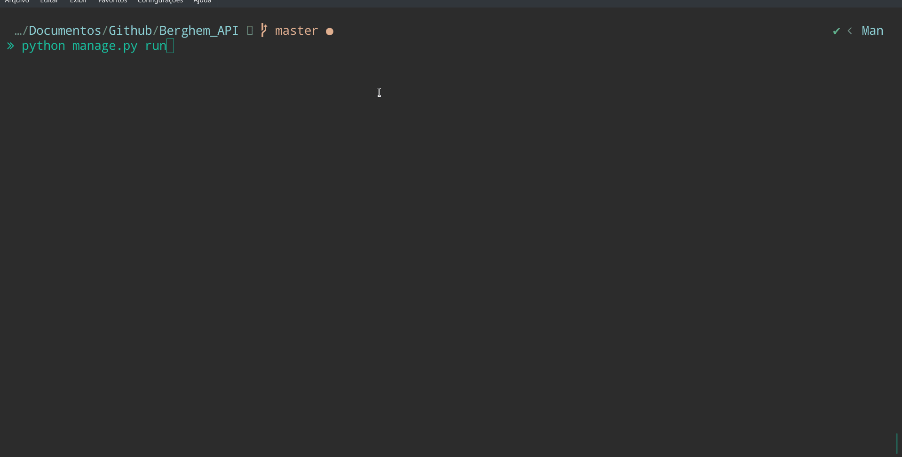

# Berghem API

### Run this project:

```sh
make create-db
make run
```

### Run tests
```sh
make test
```

### Use Swagger:


### Project Routes:
```
'/api/transaction/product_name/update' (PUT, OPTIONS) -> api.transaction_transactions_update

'/api/transaction/cash_change' (POST, OPTIONS) -> api.transaction_transactions_cash_change

'/api/transaction/delete' (OPTIONS, DELETE) -> api.transaction_transactions_delete

'/api/transaction/list' (OPTIONS, HEAD, GET) -> api.transaction_transactions_list_all

'/swagger.json' (OPTIONS, HEAD, GET) -> api.specs

'/api/' (OPTIONS, HEAD, GET) -> api.transaction_default_route

'/' (OPTIONS, HEAD, GET) -> api.doc

'/' (OPTIONS, HEAD, GET) -> api.root

'/api/transaction/list/<transaction_id>' (OPTIONS, HEAD, GET) -> api.transaction_transactions_list_id

'/swaggerui/<filename>' (OPTIONS, HEAD, GET) -> restplus_doc.static

'/static/<filename>' (OPTIONS, HEAD, GET) -> static
```


